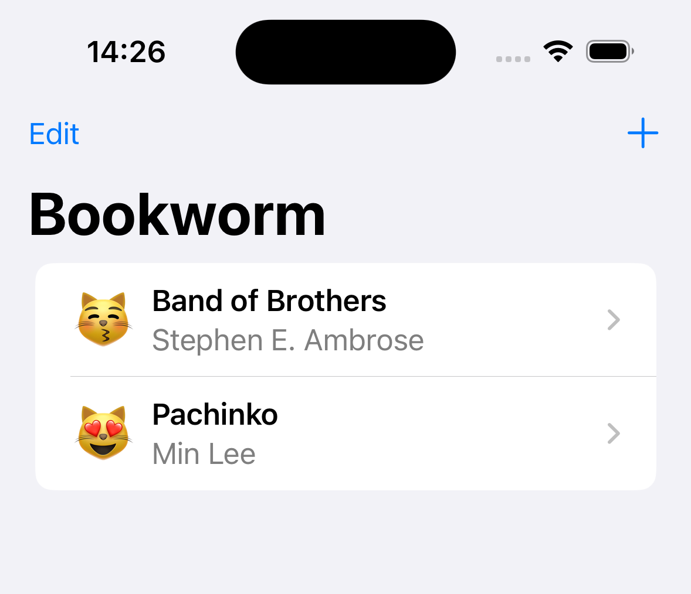

# Bookworm

A beautiful SwiftUI reading list app built with Core Data, following Paul Hudson's tutorial series.



## Overview

Bookworm is an iOS app that helps you track and rate the books you've read. Built with SwiftUI and Core Data, it demonstrates modern iOS development practices and persistent data storage.

## Features

- Add books to your reading list
- Rate books from 1-5 stars
- Write detailed reviews
- Beautiful SwiftUI interface
- Persistent storage with Core Data
- Sort and filter your book collection

## Requirements

- iOS 15.0+
- Xcode 14.0+
- Swift 5.7+

## Getting Started

1. Clone the repository

```bash
git clone https://github.com/hristo2612/Bookworm.git
```

2. Open the project in Xcode

```bash
cd Bookworm
open Bookworm.xcodeproj
```

3. Build and run the project (⌘ + R)

## Technologies Used

- **SwiftUI** - Modern declarative UI framework
- **Core Data** - Apple's framework for data persistence
- **Swift** - Programming language

## Learning Resources

This app was built following Paul Hudson's excellent SwiftUI tutorial series:

- [Hacking with Swift - 100 Days of SwiftUI](https://www.hackingwithswift.com/100/swiftui)
- [Bookworm Project Tutorial](https://www.hackingwithswift.com/books/ios-swiftui/bookworm-introduction)

## License

This project is available under the MIT license. See the LICENSE file for more info.

## Acknowledgments

Special thanks to [Paul Hudson](https://twitter.com/twostraws) for creating the amazing SwiftUI tutorials that made this project possible.

---

Made with ❤️ + SwiftUI
